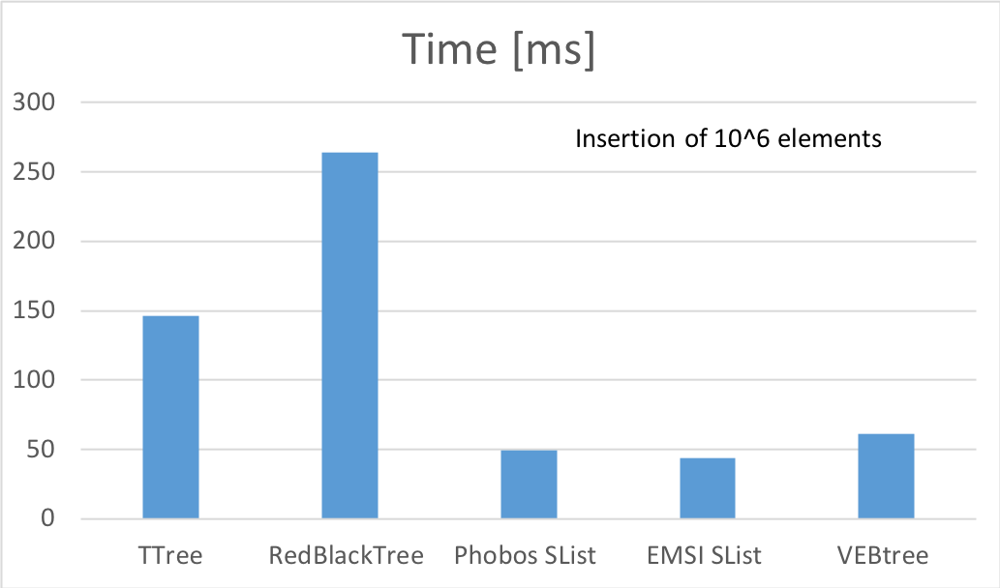
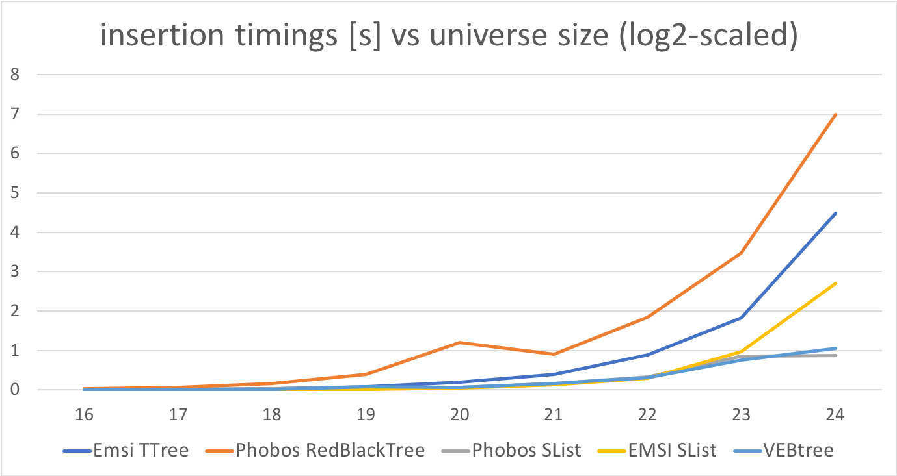

# README #

This repository contains a Van Emde Boas tree written in D. It operates on unique integer keys. 

See

https://en.wikipedia.org/wiki/Van_Emde_Boas_tree

and 

Thomas H. Cormen, Charles E. Leiserson, Ronald L. Rivest, and Clifford Stein. Introduction to Algorithms, Third Edition. MIT Press, 2009. ISBN 978-0-262-53305-8. Chapter 20: The van Emde Boas tree, pp. 531–560.

The idea of bit operations at leaf level was taken from the C++ implementation found at
http://www.keithschwarz.com/interesting/code/van-emde-boas-tree/


Example usage: 

```
import vebtree; 

enum baseSize(T : A!s, alias A, int s) = s;

void main()
{
    import std.random : unpredictableSeed, uniform; 
    
    /*
    The creation could be long, if number generated by unpredictableSeed is large, 
    but the example works even for (1UL << 32) - 1
    */
    auto root = vebRoot(unpredictableSeed); // create the tree structure. 
    const rndNum = uniform(0, root.universe); // ... and some data

    import std.math : nextPow2; 
    assert(root.capacity == (root.universe - 1).nextPow2);

    root.insert(rndNum); 
    assert(root.prev(rndNum) == size_t.max); 
    assert(root.next(rndNum) == size_t.max); 
    assert(root.front == root.back); 
    assert(root.length == 1); 
    auto root2 = root.dup; 
    root2.remove(rndNum); 
    assert(root2.empty); 
    assert(root2.length == 0); 
    assert(rndNum in root); 
    assert(root == root()); 
    assert(root[].front == 0); 
    assert(root[].back == root.universe); 
    
    import std.range : isBidirectionalRange; 
    static assert(isBidirectionalRange!(typeof(root[])));

    root.universe < baseSize!(typeof(root)) ? assert(root.isLeaf) : assert(!root.isLeaf);
    foreach(el; root) assert(el == rndNum);     
}
```

An evaluation of the library shows very good performace compared to the Phobos Red-Black tree and the TTree of EMSI containers. 







The evaluation was done with the following code: 

```
/+
// dub.json
"dependencies" : 
{
    "vebtree" : "~>0.12.0",
    "emsi_containers": "~>0.8.0-alpha.11"
}

// dub.selections.json 
{ 
	"fileVersion": 1,
	"versions": {
		"emsi_containers": "0.8.0-alpha.12",
		"mir-core": "0.2.1",
		"stdx-allocator": "2.77.5",
		"vebtree": {"path":"../../Libs/vebtree"}
	}
}
+/

import containers.ttree;
import std.container.rbtree;
import containers.slist;
import std.container.slist;
import containers.unrolledlist;
import std.experimental.allocator;
import std.experimental.allocator.building_blocks.allocator_list;
import std.experimental.allocator.building_blocks.region;
import std.experimental.allocator.mallocator;
import std.datetime.stopwatch;
import std.stdio;
import vebtree; 

// For fun: change this number and watch the effect it has on the execution time
alias Allocator = AllocatorList!(a => Region!Mallocator(1024 * 16), Mallocator);

enum NUMBER_OF_ITEMS = 1_000_000;

auto testEMSIContainer(alias Container, string ContainerName, size_t number_of_items = NUMBER_OF_ITEMS)()
{
	Allocator allocator;
	auto c = Container!(uint, typeof(&allocator))(&allocator);
	
	foreach (i; 0 .. number_of_items)
		c.insert(cast(uint)i);
}

auto testPhobosContainer(alias Container, string ContainerName, size_t number_of_items = NUMBER_OF_ITEMS)()
{
	static if (is(Container!uint == class))
		auto c = new Container!uint();
	else
		Container!uint c;
	
	foreach (i; 0 .. number_of_items)
		c.insert(cast(uint)i);
}

auto testVebTree(string ContainerName, size_t number_of_items = NUMBER_OF_ITEMS, size_t base = 0)()
{
    static if(!base)
    {
        auto c = vebRoot(number_of_items); 
    }
    else
    {
        auto c = vebRoot!base(number_of_items); 
    }
	
	foreach (i; 0 .. number_of_items)
		c.insert(i);
}

shared Duration[size_t] results; 
shared string[size_t] identifiers; 

import std.format : format; 

enum funid(T : A!s, alias A, Args...) = format!"%s : %d"(Args[0], Args[1]);

void main()
{
    import std.parallelism : parallel; 
    import std.range : iota; 

    import std.datetime.stopwatch : benchmark;
    
    uint repeats = 10; 
    enum maxBaseSize = 24;
    void function()[maxBaseSize * 5] testFunctions;

    import std.range; 

    static foreach(_; 1 .. maxBaseSize + 1)
    {
        testFunctions[0 + (_ - 1) * 5] = &testEMSIContainer!(TTree, "TTree", 1UL << _);
        identifiers[0 + (_ - 1) * 5] = format!"%s : %d"("TTree", 1UL << _); 
        
        testFunctions[1 + (_ - 1) * 5] = &testPhobosContainer!(RedBlackTree, "RedBlackTree", 1UL << _);
        identifiers[1 + (_ - 1) * 5] = format!"%s : %d"("RedBlackTree", 1UL << _); 

        testFunctions[2 + (_ - 1) * 5] = &testPhobosContainer!(std.container.slist.SList, "Phobos SList", 1UL << _);
        identifiers[2 + (_ - 1) * 5] = format!"%s : %d"("Phobos SList", 1UL << _); 

        testFunctions[3 + (_ - 1) * 5] = &testEMSIContainer!(containers.slist.SList, "EMSI SList", 1UL << _);
        identifiers[3 + (_ - 1) * 5] = format!"%s : %d"("EMSI SList", 1UL << _); 

        testFunctions[4 + (_ - 1) * 5] = &testVebTree!("VEBtree", 1UL << _);
        identifiers[4 + (_ - 1) * 5] = format!"%s : %d"("VEBtree", 1UL << _); 
    }
    
    foreach(i, _; parallel(testFunctions[]))
    {
        results[i] = benchmark!(_)(repeats)[0]/repeats;
    }

    foreach(i; testFunctions.length.iota)
    {
        Duration dur = results[i]; 
        writeln(identifiers[i], " : ", dur); 
    }

    auto results_local = benchmark!(
        testEMSIContainer!(TTree, "TTree"), 
        testPhobosContainer!(RedBlackTree, "RedBlackTree"), 
        testPhobosContainer!(std.container.slist.SList, "Phobos SList"),
        testEMSIContainer!(containers.slist.SList, "EMSI SList"),
        testVebTree!("VEBtree")
    )(repeats);

    writeln("TTree : ", NUMBER_OF_ITEMS, " : ", results_local[0]/repeats);
    writeln("RedBlackTree : ", NUMBER_OF_ITEMS, " : ", results_local[1]/repeats);
    writeln("Phobos SList : ", NUMBER_OF_ITEMS, " : ", results_local[2]/repeats);
    writeln("EMSI SList : ", NUMBER_OF_ITEMS, " : ", results_local[3]/repeats);
    writeln("VEBtree : ", NUMBER_OF_ITEMS, " : ", results_local[4]/repeats);
}
```

Measurements taken on a Intel(R) Core(TM) i7 CPU @ 2.60GHz with 16GB of memory. 
Compiled with dub run --build=release --compiler=ldc2

The tree can be expanded to contain all key up to uint max. The construction lasts appropriate time for this, however,
all operations remain fast. 

Copyright: Copyright (c) 2016- Alexander Orlov. All rights reserved.

License: https://opensource.org/licenses/BSL-1.0, BSL License

Author: Alexander Orlov, sascha.orlov@gmail.com